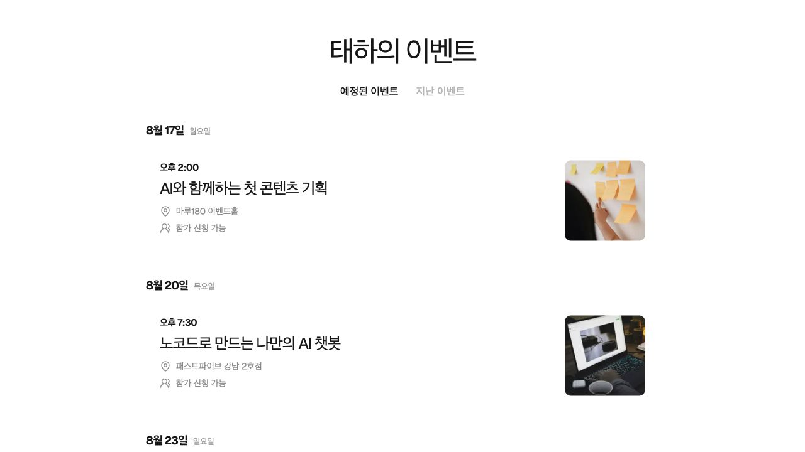
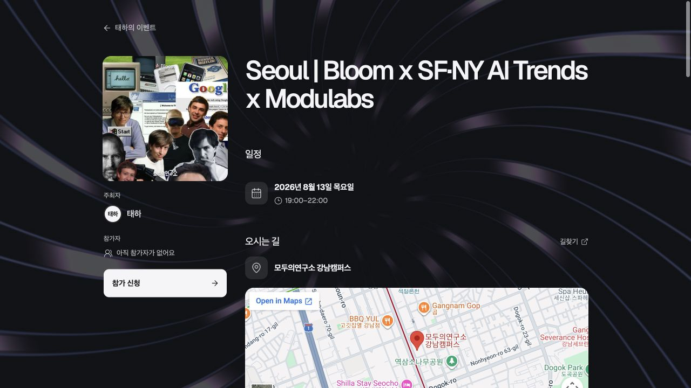
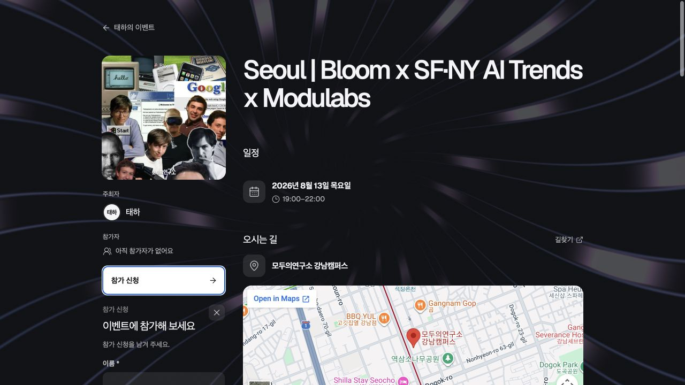

# My Personal Event App

개인 주최자가 이벤트를 만들고 링크로 공유하며 참가 신청을 관리하는 한국어 중심의 이벤트 웹앱입니다. 공개 이벤트 목록과 상세 페이지, 관리자용 생성·수정 화면, 참가자 관리, 이메일 알림을 하나의 프로젝트로 제공합니다.

[English README](./README.md) · [제품 및 구현 명세](./SPEC.md)

## 화면

### 이벤트 목록



| 공개 이벤트 페이지 | 참가 신청 패널 |
| --- | --- |
|  |  |

## 주요 기능

- 이메일·비밀번호 기반 관리자 회원가입, 로그인, 비밀번호 재설정
- 8자리 공개 링크가 자동 생성되는 이벤트 CRUD
- 오프라인 장소·지도 또는 온라인 참여 링크 지원
- Markdown 이벤트 소개와 대표 이미지
- 정적·동적 페이지 배경 프리셋 및 생성·수정 즉시 미리보기
- 자동 승인 또는 수동 승인, 정원, 신청 기간, 사용자 정의 질문
- 참가 신청, 취소, 승인 상태 관리 및 CSV 내보내기
- Gmail SMTP를 통한 신청 상태 이메일 알림(선택 사항)
- 공개·관리자 이벤트 목록과 반응형 모바일 UI

## 기술 구성

- Next.js 16 App Router, React 19, TypeScript
- Supabase Auth, Postgres, Storage, Row Level Security
- Vercel 배포
- React Hook Form, Zod, React Markdown/MDX Editor
- React Bits 기반 배경, Three.js/OGL, tsParticles
- Playwright E2E, ESLint, TypeScript

## 사전 준비

- 지원되는 Node.js 버전(22 LTS, 24 LTS 또는 26 이상)과 npm
- Supabase 프로젝트
- 배포 시 Vercel 계정
- 이메일 알림을 사용할 경우 2단계 인증을 활성화한 Google 계정과 Gmail 앱 비밀번호

## 로컬 실행

```bash
git clone <YOUR_REPOSITORY_URL>
cd my-personal-event-app
npm install
cp .env.example .env.local
```

`.env.local`에 값을 입력합니다.

```dotenv
NEXT_PUBLIC_APP_URL=http://localhost:3000
NEXT_PUBLIC_SUPABASE_URL=https://your-project.supabase.co
NEXT_PUBLIC_SUPABASE_PUBLISHABLE_KEY=...
SUPABASE_SECRET_KEY=...
GMAIL_USER=...                  # 선택
GMAIL_APP_PASSWORD=...         # 선택
```

`SUPABASE_SECRET_KEY`와 Gmail 앱 비밀번호는 서버 전용 비밀 값입니다. Git에 커밋하거나 `NEXT_PUBLIC_` 접두사를 붙이면 안 됩니다.

### Supabase 설정

Supabase CLI를 연결한 경우 마이그레이션을 순서대로 적용합니다.

```bash
npx supabase login
npx supabase link --project-ref <PROJECT_REF>
npx supabase db push
```

CLI를 사용하지 않으면 `supabase/migrations/`의 SQL 파일을 번호 순서대로 SQL Editor에서 실행합니다. 초기 마이그레이션이 공개 Storage 버킷 `event-covers`를 생성합니다. 이후 Authentication URL Configuration에 다음 주소를 등록합니다.

- Site URL: 로컬에서는 `http://localhost:3000`, 배포 후 실제 프로덕션 origin
- Redirect URL: `http://localhost:3000/auth/callback`
- 배포 후 Redirect URL: `https://<YOUR_DOMAIN>/auth/callback`

회원가입은 Auth 사용자만 생성하며 관리자 권한을 자동 부여하지 않습니다. 승인할 주최자의 Auth UUID를 `public.admin_users`에 추가합니다.

```sql
insert into public.admin_users (user_id)
values ('AUTH_USER_UUID');
```

이후 Row Level Security가 각 관리자를 자신이 만든 이벤트로 제한합니다. 전체 절차는 [SPEC.md](./SPEC.md)의 외부 서비스 설정 항목을 따르세요.

### Gmail 이메일(선택)

Google 계정에서 2단계 인증을 켜고 앱 비밀번호를 발급한 뒤 `GMAIL_USER`, `GMAIL_APP_PASSWORD`를 설정합니다. 값이 없으면 핵심 이벤트·신청 기능은 동작하지만 이메일 발송은 실패 상태로 기록됩니다. Supabase Auth 확인·재설정 메일은 Supabase의 별도 SMTP 설정입니다.

### 개발 서버

```bash
npm run dev
```

브라우저에서 [http://localhost:3000](http://localhost:3000)을 엽니다.

## 명령어

| 명령어 | 설명 |
| --- | --- |
| `npm run dev` | 개발 서버 실행 |
| `npm run build` | 프로덕션 빌드 생성 |
| `npm run start` | 프로덕션 서버 실행 |
| `npm run typecheck` | TypeScript 검사 |
| `npm run lint` | ESLint 검사 |
| `npm run test:e2e` | Playwright E2E 실행 |

## 배포

1. 저장소를 GitHub에 푸시합니다.
2. Vercel에서 저장소를 Import합니다.
3. `.env.example`의 모든 필수 환경변수를 Vercel Production에 등록합니다.
4. `NEXT_PUBLIC_APP_URL`을 실제 프로덕션 origin으로 변경합니다.
5. Supabase Site URL과 Redirect URL에 프로덕션 주소를 추가합니다.
6. 배포 후 회원가입, 로그인, 이벤트 생성, 공개 링크, 참가 신청·취소 흐름을 점검합니다.

자세한 설정과 검수 기준은 [SPEC.md](./SPEC.md)를 참고하세요.

## 저장소 구조

```text
app/                    페이지와 API Route Handler
components/             공통 UI와 이벤트 경험 컴포넌트
lib/                    도메인 로직, 검증, Supabase·이메일 연동
supabase/migrations/    DB 스키마, 함수, RLS 정책
tests/e2e/              Playwright 테스트
SPEC.md                 제품·디자인·기술 구현 계약
```

## 라이선스

앱 자체 코드는 [MIT License](./LICENSE)로 제공됩니다. React Bits에서 파생된 컴포넌트에는 별도의 MIT + Commons Clause 조건이 적용되며, 자세한 내용은 [THIRD_PARTY_NOTICES.md](./THIRD_PARTY_NOTICES.md)를 확인하세요.
